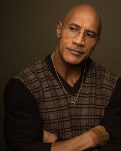
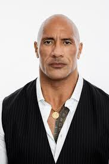

<!DOCTYPE html>
<html lang="en">
<head>
    <meta charset="UTF-8">
    <meta name="viewport" content="width=device-width, initial-scale=1.0">
    <meta name="author" content="Rasleen Kaur">
    <meta name="description" content="An informational webpage about Dwayne “The Rock” Johnson.">
    <meta name="keywords" content="Dwayne Johnson, The Rock, WWE, Actor, Hollywood">
    <title>All About Dwayne Johnson</title>
    <link rel="stylesheet" href="css/profile.css">
</head>
<body>
    
 
    <header>
        <h1>The Life and Career of Dwayne Johnson</h1>
        
Dwayne Douglas Johnson, known as <strong>“The Rock,”</strong> is an American
actor, producer, entrepreneur, and former professional wrestler. Born on May 2, 1972, he is <strong>
one of the most influential figures </strong> in sports entertainment and Hollywood.

<nav>
<ul>
    <li><a href="#life">Early Life and Background</a></li>
    <li><a href="#career">Wrestling Career and Rise to Fame</a></li>
    <li><a href="#acting">Acting Career and Major Roles</a></li>
    <li><a href="#achievements">Achievements and Business Ventures</a></li>
    <li><a href="#gallery">Gallery</a></li>
</ul>
</nav>
    </header>

    <main>
    <!-- Section 1  -->
      <section id="life">
        <h2>Early Life and Background</h2>
        
Dwayne Johnson was born in Hayward, California and raised in a
family with a wrestling legacy. He attended <mark>the University of Miami</mark> <a href="https://welcome.miami.edu" target="_blank">
    Welcome to UM.
  </a> on a football scholarship and was
part of the 1991 national championship team. <a href="https://news.miami.edu/stories/2026/01/going-home-hurricanes-vie-for-national-title-on-their-home-field.html"
     target="_blank">
    Hurricanes Vie for National Title.
  </a>

After a football injury ended his career, he pursued
wrestling.

      </section>

<!-- Section 2  -->
      <section id="career">
        <h2>Wrestling Career and Rise to Fame</h2>
        
Johnson debuted in WWE in 1996 and became one of the most
popular wrestlers of all time. His charisma and confidence made him a defining figure of the Attitude
Era.

      </section>
<!-- Section 3 -->
<section id="acting">
    <h3>Acting Career and Major Roles</h3>
    <ol>
        <li>The Scorpion King (2002)</li>
        <li>The Game Plan (2007)</li>
        <li>Race to Witch Mountain (2009)</li>
        <li>Fast & Furious Series (2001 to present)</li>
        <li>Snitch (2013)</li>
        <li>San Andreas (2015)</li>
        <li>Central Intelligence (2016)</li>
        <li>Moana (2016)</li>
        <li>Jumanji: Welcome to the Jungle (2017)</li>
        <li>Rampage (2018)</li>
    </ol>
</section>
<section id="achievements">
   <h3>Achievements and Business Ventures</h3> 
   <ul>
<li>Entered WWE and began wrestling career (1996)</li>
<li>Became multiple-time WWE Champion (late 1990s–2000s)</li>
<li>Transitioned from wrestling to acting (2002)</li>
<li>Co-founded Seven Bucks Productions (2012)</li>
<li>Named one of Forbes’ highest-paid actors (mid to late 2010s)</li>
<li>Expanded into global brand endorsements (late 2010s)</li>
<li>Founded Teremana Tequila (2020)</li>
<li>Recognized philanthropist and motivational figure (ongoing)</li>
</ul>
</section>

<section id="gallery">
    <h3>Gallery</h3>

</section>
    </main>

<footer>
    
Author Info: Rasleen Kaur is an accounting and finance major at the University of Miami. 
She is from Atlanta, Georgia and currently resides in Miami, Florida. Rasleen is a fan of
Dwayne Johnson since childhood.

</footer>  
</body>
</html>